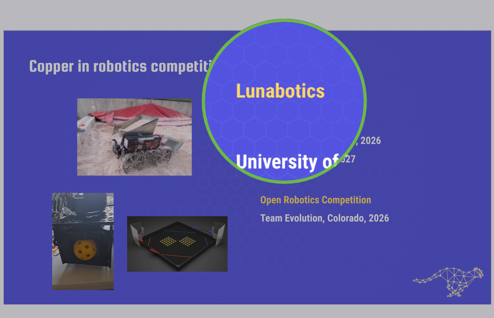
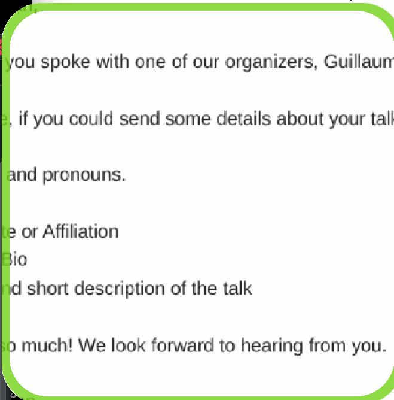
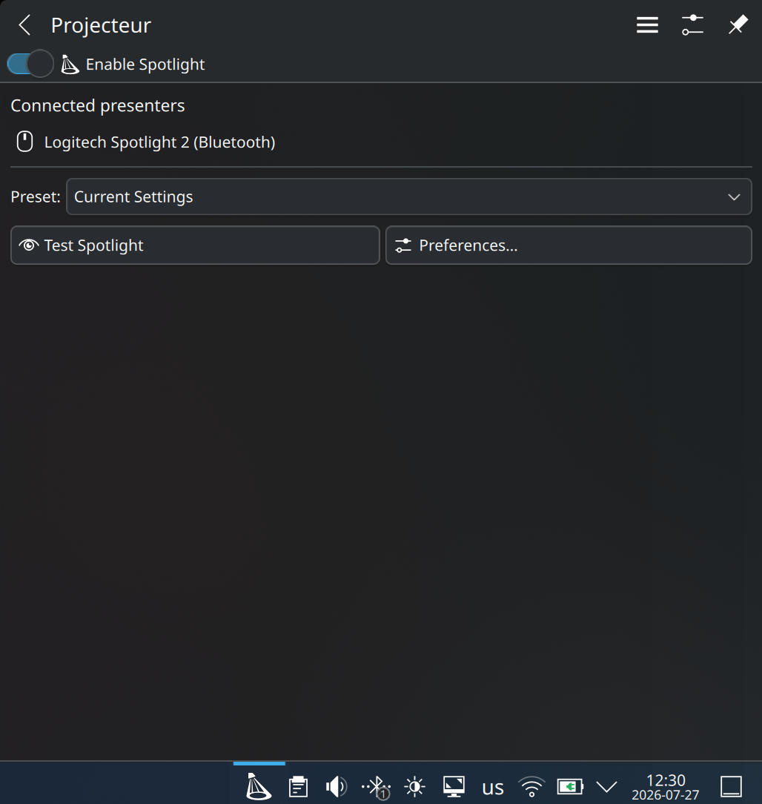
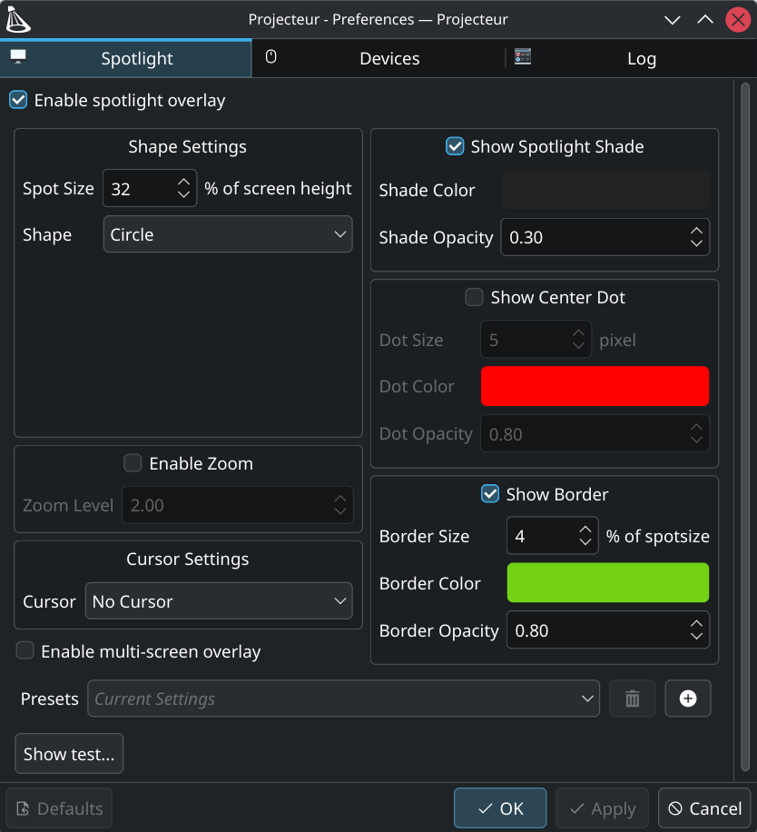

# Projecteur

**A virtual laser pointer and live magnifier built for KDE Plasma presentations.**

[](https://github.com/gbin/Projecteur/actions/workflows/ci-build.yml?query=branch%3Adevelop)


[](./LICENSE.md)

Projecteur turns a Logitech Spotlight—or another supported presenter—into an
on-screen spotlight your audience can see in the room, in a screen share, and in
the recording. Point, magnify, change slides, run a timer, and keep everything
close at hand in Plasma.

[](./doc/screenshot-spot.png)

> [!NOTE]
> The current development line requires **KDE Plasma 6.7 or newer**, **Qt 6.11
> or newer**, and a **Wayland session**. The previous Qt 5, X11, and
> cross-desktop codebase is maintained for critical fixes on the
> [`legacy/qt5`](https://github.com/gbin/Projecteur/tree/legacy/qt5) branch.

## Why Projecteur?

- **Visible everywhere.** Unlike a physical laser, the spotlight appears in
  projectors, screen shares, and recordings.
- **Live magnification.** KWin and KPipeWire keep video, animation, and changing
  content moving inside the zoom area.
- **Made for Plasma.** Native system tray controls, global shortcuts,
  notifications, and multi-screen support feel at home on KDE.
- **Designed for presenting.** Save spotlight presets, remap presenter buttons,
  control volume or scrolling, and use haptic timer alerts on compatible devices.
- **Useful without hardware.** Trigger the spotlight from a global shortcut for
  online demos and video calls.

## See it in action

### Magnify the content, not the pixels

Choose smooth scaling for images, edge-enhanced **Text and UI** mode for
documents and application demos, or pixel-perfect scaling for source pixels.
The zoom mode is saved with each spotlight preset.

[](./doc/screenshot-text-zoom.png)

### Stay in control from the Plasma panel

See connected presenters, test the spotlight, switch presets, start a
presentation timer, and open preferences without breaking your flow.

[](./doc/screenshot-traymenu.png)

### Make the spotlight yours

Tune the shape, shade, zoom, cursor, border, multi-screen behavior, and presets
with native KDE controls.

[](./doc/screenshot-settings.png)

## Install

Projecteur is under active development and currently distributed from source.
The install step is important: KWin grants zoom access using Projecteur's
installed desktop metadata, and the presenter needs the installed udev rules.

### Arch Linux and Arch-based distributions

Install [`just`](https://github.com/casey/just), then use the included packaging
workflow. It installs missing build dependencies, creates a native package, and
installs it with `pacman`.

```sh
sudo pacman -S --needed just
git clone https://github.com/gbin/Projecteur.git
cd Projecteur
just install
```

### Other distributions

Install the [build dependencies](./CONTRIBUTING.md#requirements), then:

```sh
git clone https://github.com/gbin/Projecteur.git
cd Projecteur
cmake -S . -B build \
  -DCMAKE_BUILD_TYPE=Release \
  -DCMAKE_INSTALL_PREFIX=/usr \
  -DPACKAGE_TARGETS=OFF
cmake --build build --parallel
sudo cmake --install build
sudo udevadm control --reload-rules
sudo udevadm trigger
```

Reconnect the presenter after installing, then launch **Projecteur** from the
application menu.

## Your first minute

1. Open the Projecteur applet in the Plasma system tray.
2. Confirm that your presenter appears under **Connected presenters**.
3. Select **Test Spotlight** to try the current look.
4. Open **Preferences** to adjust the spotlight or map presenter buttons.
5. Optionally assign **Toggle Spotlight** under **Preferences → Shortcuts** for
   keyboard-only use.

The applet can also start a presentation timer immediately or on the next button
press. While it runs, the panel badge shows the remaining minutes; compatible
presenters vibrate when time expires.

## Supported presenters

| Presenter | Connection | Device ID |
| --- | --- | --- |
| Logitech Spotlight | USB receiver / Bluetooth | `046d:c53e` / `046d:b503` |
| Logitech Spotlight 2 | Logi Bolt USB-C receiver / Bluetooth | `046d:c548` / `046d:b506` |
| Lenovo ThinkPad X1 Presenter Mouse | USB / Bluetooth | `17ef:60d9` / `17ef:60db` |
| AVATTO H100 / August WP200 | USB | `0c45:8101` |
| August LP315 | USB | `2312:863d` |
| AVATTO i10 Pro | USB | `2571:4109` |
| August LP310 | USB | `69a7:9803` |
| Norwii Wireless Presenter | USB | `3243:0122` |
| Kensington PowerPointer | USB | `1ea7:0002` |

Projecteur can also accept an additional device at runtime with
`--additional-device VENDOR:PRODUCT`. See `projecteur --help` for details.

## Need help?

- **Presenter not detected?** Run `projecteur --device-scan`. A detected device
  that is not readable or writable usually means the udev rules are missing or
  stale.
- **Zoom not working?** Confirm that Projecteur is installed—not run only from
  the build directory—and that the session is KDE Plasma on Wayland.
- **Applet missing?** Check that Projecteur is running and enabled in the Plasma
  system tray configuration.

The [troubleshooting guide](./doc/TROUBLESHOOTING.md) has detailed checks. If the
problem remains, [open an issue](https://github.com/gbin/Projecteur/issues)
with the output of `projecteur --fullversion` and `projecteur --device-scan`.

## Documentation

- [User guide](./doc/USER-GUIDE.md) — presets, zoom modes, button mapping,
  shortcuts, timers, and device-free use
- [Troubleshooting](./doc/TROUBLESHOOTING.md) — display, zoom, device access, and
  system tray diagnostics
- [Changelog](./doc/CHANGELOG.md)
- [Contributing and development setup](./CONTRIBUTING.md)
- Command-line reference: `man projecteur`

## About Projecteur

Projecteur was created by Jahn Fuchs and transferred to Guillaume Binet in 2026.
The current development line adds a native Plasma 6 experience, a
Wayland-native overlay and live zoom pipeline, and Logitech Spotlight 2 support.
Please report problems in the [Projecteur issue tracker](https://github.com/gbin/Projecteur/issues).

## License

Projecteur is available under the [MIT License](./LICENSE.md).

Copyright © 2018–2021 Jahn Fuchs. Current development copyright © 2026
Guillaume Binet and Projecteur contributors.
